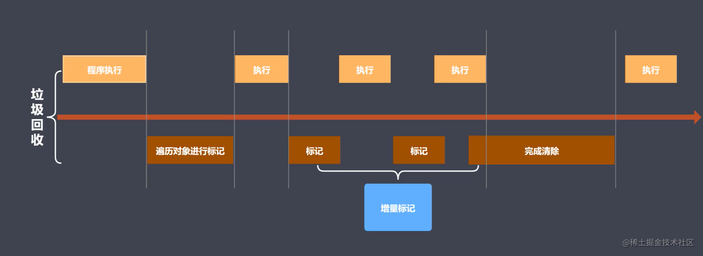

## 详细解析
V8是一款主流的js执行引擎，采用即时编译。V8引擎回收策略是，采用分代回收（Generation GC）思想，内存分为新生代和老生代，空间和针对不同对象存储的数据类型略有不同。V8中常用的GC算法：分代回收、空间复制、标记清除、标记整理、标记增量。

### 内存限制
V8引擎内存设置了上限，V8内存空间一分为二，小空间用于存储新生代对象，大空间用于存储老生代对象：

1. 64位系统下约为1.4GB，新生代内存大小为16MB，老生代内存大小为700MB
2. 32位系统下约为0.7GB，新生代内存大小为32MB，老生代内存大小为1.4GB
新生代平均分成两块相等的内存空间，叫做semispace，每块内存大小8MB（32位）或16MB（64位）。

这个限制在node启动的时候可以通过传递--max-old-space-size 和 --max-new-space-size来调整，如：

```shell
node --max-old-space-size=1700 app.js //单位为MB
node --max-new-space-size=1024 app.js //单位为MB
```
上述参数在V8初始化时生效，一旦生效就不能再动态改变。

#### 内存限制的原因

表面上的原因是V8最初是作为浏览器的JavaScript引擎而设计，不太可能遇到大量内存的场景。而深层次的原因则是由于V8的垃圾回收机制的限制。

由于V8需要保证JavaScript应用逻辑与垃圾回收器所看到的不一样，V8在执行垃圾回收时会阻塞JavaScript应用逻辑，直到垃圾回收结束再重新执行JavaScript应用逻辑，这种行为被称为“全停顿”（stop-the-world）。

若V8的堆内存为1.5GB，V8做一次小的垃圾回收需要50ms以上，做一次非增量式的垃圾回收甚至要1秒以上。这样浏览器将在1s内失去对用户的响应，造成假死现象。如果有动画效果的话，动画的展现也将显著受到影响。

### 新生代回收
新生代中的对象主要是指存活时间较短的对象，例如局部变量。新生代中对象主要通过Scavenge算法进行垃圾回收。在Scavenge的具体实现中，主要采用Cheney算法和标记整理。

### Cheney算法
Cheney算法是一种采用复制的方式实现的垃圾回收算法，它将堆内存一分为二，然后把 A 空间内容复制到 B 空间，然后将 A 中的内容全部当做垃圾回收。这两个空间中只有一个处于使用中，一个处于闲置状态。处于使用状态的空间称为From空间，处于闲置的空间称为To空间。

#### 回收过程

分配对象时，先是在From空间中进行分配，当开始垃圾回收时，会检查From空间中的存活对象，并将这些存活对象标记整理后将活动对象复制到To空间中，而非存活对象占用的空间被释放。完成复制后，From空间和To空间角色互换。

简而言之，垃圾回收过程中，就是通过将存活对象在两个空间中进行复制。

Scavenge算法的缺点是只能使用堆内存中的一半，但由于它只复制存活的对象，对于生命周期短的场景存活对象只占少部分，所以在时间效率上有着优异的表现。

#### 新生代晋升

以上所说的是在纯Scavenge算法中，但是在分代式垃圾回收的前提下，From空间中存活的对象在复制到To空间之前需要进行检查，在一定条件下，需要将存活周期较长的对象移动到老生代中，这个过程称为对象晋升。

有几类对象会移动至老生代中，分别是：

1. 在老生代中使用的一些对象
2. 在一轮GC之后还存活的对象
3. To空间使用率超过内存的25%后

### 老生代回收
老生代中的对象指的是：存活时间较长的对象，例如全局对象，闭包中的对象。由于存活对象占比较大，再采用Scavenge方式会有两个问题：一个是存活对象就较多，复制存活对象的效率将会降低；另一个依然是浪费一半空间的问题。为此，V8在老生代中主要采用标记清除(Mark-Sweep)、标记整理(Mark-Compact)、增量标记算法几种方式相结合进行垃圾回收。

#### 回收过程
Scavenge只复制活着的对象，而标记清除只清除死了的对象。活对象在新生代中只占较少部分，死对象在老生代中只占较少部分，这就是两种回收方式都能高效处理的原因。但是这个算法有个比较大的问题是，内存碎片太多。如果出现需要分配一个大内存的情况，由于剩余的碎片空间不足以完成此次分配，就会提前触发垃圾回收，而这次回收是不必要的。所以在此基础上提出标记整理算法。

老生代回收的过程如下：

1. 在标记阶段：遍历堆内存中的所有对象，并标记活着的对象，在随后的清除阶段，只清除没有被标记的对象。
2. 标记整理阶段：将活着的对象向内存空间的一端移动，移动完成后，直接清理掉边界外的所有内存。
3. 增量标记：将一整段的垃圾回收操作拆分成多个步骤，组合完成回收。
首先使用标记清除算法完成垃圾空间的回收，相对空间碎片问题，速度提升比较明显。标记整理针对的是新生代晋升老生代时，老生代内存空间不足的对象。最后采用增量标记算法进行效率优化。

### 增量标记算法
* 将一整段的垃圾回收操作拆分成多个步骤，组合完成回收，这样可以实现垃圾回收和程序执行交替完成，可以让时间消耗更合理。
* 增量标记可以理解为增量标记就是基于标记整理和标记清除算法的整合，增量标记可以看做是 V8 引擎本身最终采用的一种优化后的 GC 算法，所以认为最终使用的都是增量标记
* 增量标记工作过程中需要用到的就是标记清除，增量标记主要是对于时间调度的制定




### 总结
关于几种算法的理解，整理如下：

1. 引用计数通过设置引用数，判断当前对象是否为零引用的方式进行垃圾回收
2. 标记整理的过程：标记可达对象=>遍历删除可达对象=>清除标记
3. 标记清除弥补了引用计数算法的缺陷，循环引用问题
4. 标记整理和标记清除区别是在清除阶段先执行整理，后移动对象位置
5. Cheney算法是一种采用复制的方式实现的垃圾回收算法
6. 增量标记算法就是基于标记整理和标记清除算法的整合

## 面试回答
### 垃圾回收机制
根据存活时间，内存分为新生代和老生代，新生代由from和to两部分组成，from 为正在使用的内存，to为闲置内存；

#### 新生代的内存回收
采用Scavenge算法，先将from里的对象检查一遍，如果对象存活，则复.制到to中（按顺序排放），将非存活对象进行回收,当所有存活对象进入to中，然后交换from和to，from变为闲置内存，to变为正在使用内存
如果一个对象经过多次交换依然存在或者新的数据太大，则将其放置在老生代中

#### 老生代的内存回收
- 标记清除
在这个阶段分为标记阶段和清除阶段，首先会遍历堆中的所有对象，并做上标记，对于那些未在代码环境中使用的变量和强引用的变量 进行取消标记并在随后的清除阶段进行回收

- 标记整理
在清除阶段完成后，由于是在堆里清除，所以清除完后会产生内存碎片问题，存活对象的空间不连续导致对后续分配空间造成障碍，所以需要整理碎片：将存活的对象全部往一边靠拢，由于是移动对象，它的执行速度不可能很快，事实上也是整个过程中最耗时间的部分。

- 优化— 增量标记
由于JS的单线程机制，V8 在进行垃圾回收的时候，不可避免地会阻塞业务逻辑的执行，倘若老生代的垃圾回收任务很重，那么耗时会非常可怕，严重影响应用的性能。那这个时候为了避免这样问题，V8 采取了增量标记的方案。
将标记任务分为许多小任务，在执行完一个小任务后，让js的逻辑代码执行一会儿，然后再执行下一个小任务。

经过增量标记之后，垃圾回收机制对js的阻塞时间降低至原来的1/6

#### 老生代和新生代清除方式的不同
Scavenge只复制活着的对象，而标记清除只清除死了的对象。活对象在新生代中只占较少部分，死对象在老生代中只占较少部分，这就是两种回收方式都能高效处理的原因